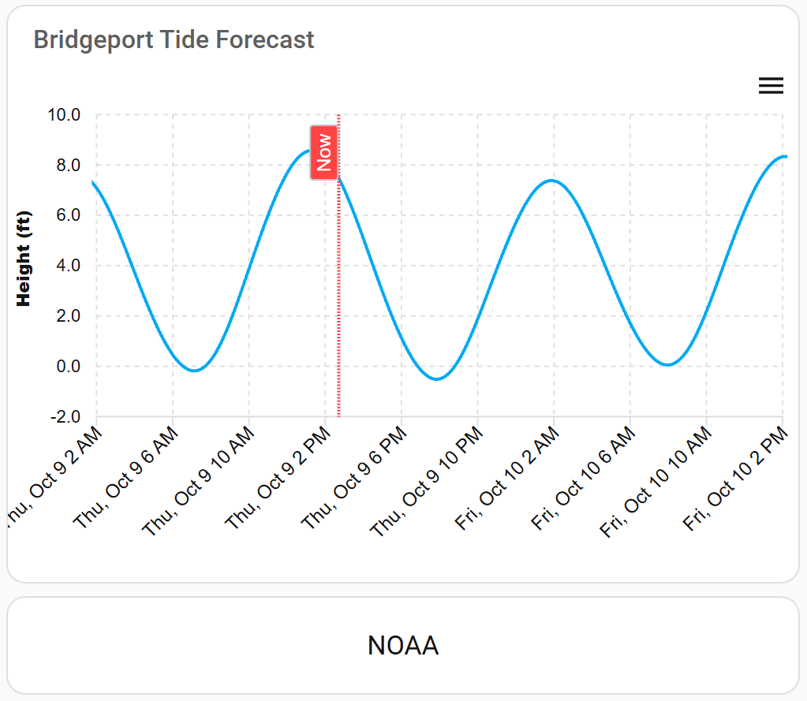
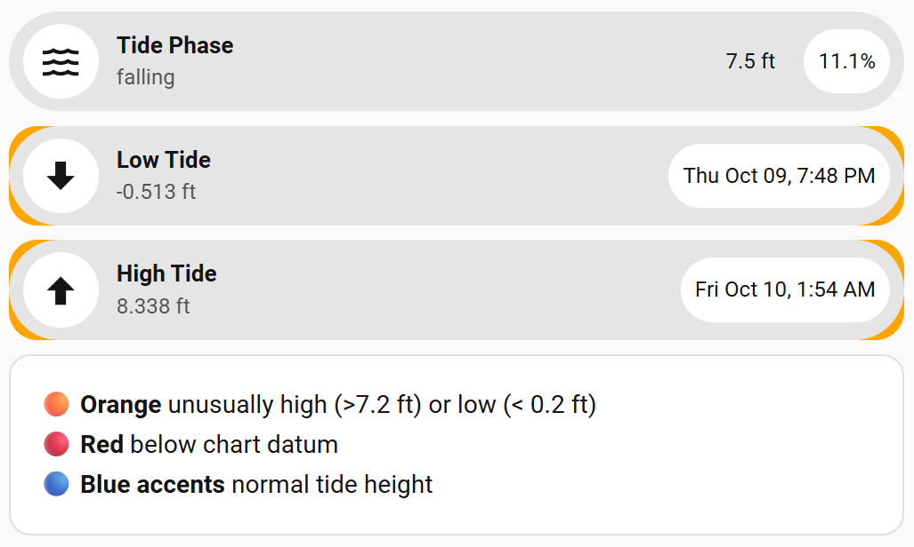

# Angler-Tides-Homeassistant
A project to capture NOAA tide data and present in a useful way in a homeassistant dashboard

A compact, HA‑native tide dashboard driven by the NOAA CO‑OPS **predictions** API.  
It shows the live tide height and phase, the next **low** and **high** tide (time & height), and a multi‑day waveform with a “Now” marker and color coded highlights for unusually high/low events.  
You would need to determine mean tides for your local tide stations.  I asked AI for average high and low tides based upon Mean Lower Low Water (MLLW) and then edited the dashboard card_mod for these values.

<p align="center">
  <br/>
  
</p>

---

## Features

- Uses official **NOAA Tides & Currents** predictions (JSON)
- Template sensors compute **current height**, **rising/falling phase**, **next low/high** times & heights, and **percent of cycle**
- ApexCharts line chart with **Now** vertical marker
- Optional accents/legend for unusually high/low tides
- Recorder excludes the large JSON payload to minimize DB growth

---

## Repository layout

```
.
├── assets/                 # screenshots (and optional view YAML if you add it)
├── configuration/          # YAML: REST + template sensors (phase/now/hi/lo/percent)
└── helpers/                # 7 UI helpers (thresholds, toggles, options)
```

**Helpers (suggested IDs):**

- `input_number.tide_high_threshold_ft` (default **7.2**)
- `input_number.tide_low_threshold_ft`  (default **0.2**)
- `input_boolean.tide_show_legend`
- `input_boolean.tide_show_noaa_link`
- `input_text.tide_station_id` *(optional; if you want station configurable in UI)*
- `input_select.tide_datum` *(optional; e.g., MLLW/MHHW)*
- `input_number.tide_chart_days` *(optional; days shown in chart, e.g., 5)*

> If your helper/entity IDs differ, adjust the Lovelace YAML accordingly.

---

## Requirements

- Home Assistant **2024.6+** (tested on recent releases)
- **HACS**:
  - [`apexcharts-card`](https://github.com/RomRider/apexcharts-card) *(required for the chart)*
  - *(Optional)* your preferred UI cards (Mushroom / Button-card) for styling

---

## Quick start

### 1) Copy files

- Put all YAML under `configuration/` into a **packages** folder, e.g.:
  ```
  /config/packages/tides/
  ```
- Copy `helpers/` into your config (or create equivalent Helpers via **Settings → Devices & Services → Helpers**).
- Copy `assets/` to where you serve images, e.g. `/config/www/tides/`.

### 2) Enable packages (if not already)

```yaml
# configuration.yaml
homeassistant:
  packages: !include_dir_named packages
```

### 3) NOAA REST sensor

Add this to a package (preferred) or into `configuration.yaml`.  
This example uses **Bridgeport, CT** (station **8467150**), datum **MLLW**, feet.

```yaml
sensor:
  - platform: rest
    name: Bridgeport Tide Predictions
    resource_template: >-
      https://api.tidesandcurrents.noaa.gov/api/prod/datagetter
      ?product=predictions
      &application=homeassistant
      &begin_date={{ (as_timestamp(now()) - 5*86400) | timestamp_custom('%Y%m%d') }}
      &range=240
      &datum=MLLW
      &station=8467150
      &time_zone=lst_ldt
      &units=english
      &format=json
    method: GET
    scan_interval: 86400
    value_template: >
      
        {{ value_json.predictions | count }}
      
        API Error
      
    json_attributes:
      - predictions

recorder:
  exclude:
    entities:
      - sensor.bridgeport_tide_predictions
```

### 4) Template sensors (files included)

Place these files from `configuration/` into your packages folder. They create the following entities:

- `tide phase.yaml` → `sensor.tide_phase` (rising/falling)
- `tide height now.yaml` → `sensor.tide_height_now`
- `tide low time.yaml` → `sensor.tide_low_time`
- `tide low height.yaml` → `sensor.tide_low_height`
- `tide high time.yaml` → `sensor.tide_high_time`
- `tide high height.yaml` → `sensor.tide_high_height`
- `tide percent.yaml` → `sensor.tide_percent_cycle`

> These files assume the REST sensor ID is `sensor.bridgeport_tide_predictions`.  
> If your ID differs, update the templates accordingly.

### 5) Dashboard (Lovelace)

Add the provided view (or paste these cards into an existing view):

- **ApexCharts – Tide Height Forecast**
  - Series: predicted height vs time (built from the `predictions` attribute)
  - Vertical rule labeled **Now** at `now()`
  - Accent markers when:
    - `sensor.tide_high_height > input_number.tide_high_threshold_ft` (orange)
    - `sensor.tide_low_height  < input_number.tide_low_threshold_ft`  (orange)
- **Chips / Entity rows** for:
  - Tide phase with live height (e.g., “falling • 7.5 ft • 11%”)
  - Next **Low Tide**: time + height (orange ring if below threshold)
  - Next **High Tide**: time + height (orange ring if above threshold)
  - Optional **NOAA** link to the official station page

> If you prefer, create a file `assets/tide_dashboard.yaml` with the full Lovelace view and paste it into your dashboard (Raw configuration editor).

---

## How it works

1. **REST pull**: once per day (`scan_interval: 86400`), NOAA returns a JSON array of `{t: "YYYY-MM-DD HH:MM", v: "<ft>"}` points.
2. **Templates**: Jinja searches the array around `now()` to compute:
   - Current height (interpolated), phase (rising/falling), and percent through the tide cycle
   - Next low/high times and their heights
3. **ApexCharts**: renders the waveform from the predictions; a vertical rule marks *Now*.
4. **Accents**: helpers drive thresholds for “unusually high/low” chips and the legend.

---

## Configuration options

- **Station:** change `station=8467150` to any NOAA CO‑OPS station ID
- **Datum:** default **MLLW** (match your local charts); can be a helper if you prefer
- **Units:** `english` (feet). Switch to `metric` for meters
- **Refresh:** daily is sufficient because predictions are static; lower it if you want faster recovery after restarts

---

## Entities (reference)

| Entity                          | Description                          | Unit |
|---------------------------------|--------------------------------------|------|
| `sensor.bridgeport_tide_predictions` | Raw NOAA predictions (JSON attrib.) | —    |
| `sensor.tide_height_now`        | Interpolated current tide height     | ft   |
| `sensor.tide_phase`             | `rising` / `falling`                 | —    |
| `sensor.tide_percent_cycle`     | % through current cycle              | %    |
| `sensor.tide_low_time`          | Next low tide timestamp              | datetime |
| `sensor.tide_low_height`        | Height at next low                   | ft   |
| `sensor.tide_high_time`         | Next high tide timestamp             | datetime |
| `sensor.tide_high_height`       | Height at next high                  | ft   |

---

## Troubleshooting

- **API Error / Empty chart**
  - Verify the station ID supports **predictions** on the NOAA API.
  - Confirm `sensor.bridgeport_tide_predictions` has a `predictions` attribute (Developer Tools → States).
- **Wrong time zone**
  - URL uses `time_zone=lst_ldt` (local standard/daylight time). Use `gmt` for UTC.
- **No markers / accents**
  - Ensure helpers are created and Lovelace references the correct helper entity IDs.

---

## Credits & License

- Data © NOAA/NOS/CO‑OPS. See the [NOAA Tides & Currents](https://api.tidesandcurrents.noaa.gov/) terms.
- Screenshots are from this project’s HA dashboard.
- License: **MIT** (change if you prefer).
